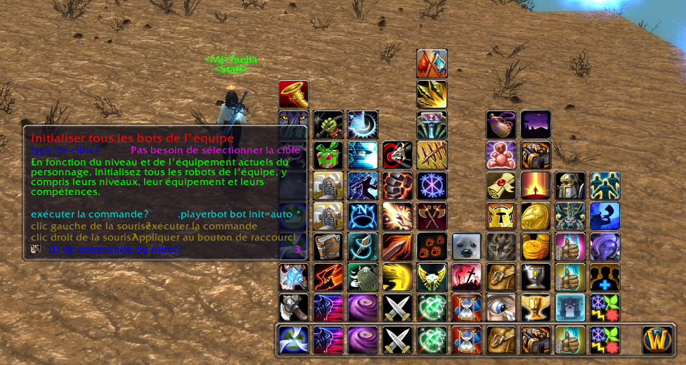
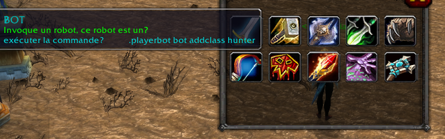

## UnBot for AzerothCore Module

Un plug-in de contrôle de robot modifié sur la base du plug-in UnBot. En tant que plug-in de support pour le module robot AzerothCore, il est pratique pour les joueurs de contrôler les robots.

Méthode d'installation : Placez UnBot et YssBossLoot dans le répertoire Interface/AddOns/

Affichage de l'interface du plug-in :

Ajouter un robot professionnel spécifié :

